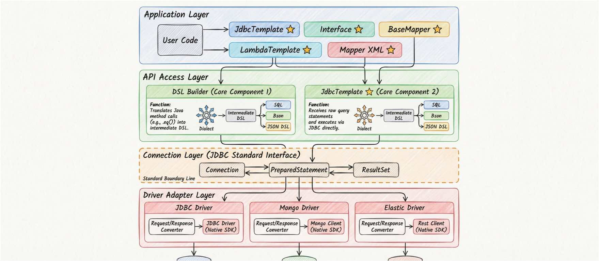

数据访问层（DAL）技术已经非常成熟，从最早的 JDBC 到 Hibernate、MyBatis，再到 Spring Data JPA。我们习惯了用这些框架处理数据。然而，当我们把目光投向“数据”本身的变化时，会发现这些经典的框架似乎正逐渐变为“老一代”。

新一代的挑战不再仅仅是如何优雅地写 SQL，而是如何用统一的方式访问那些不再仅仅存储在关系型数据库中的数据。

<!-- truncate -->

## 一、老旧的一代

谈论 “老一代” 数据访问库，并非贬义，而是指它们诞生的时代背景和核心使命。

在过去以及现在，**MyBatis**、**Hibernate**、**JPA (Hibernate)**、**Spring JDBC Template** 以及 **Apache Commons DbUtils** 统治了 Java 开发者的工具箱。它们的共同特征非常明显：
1.  **关系型数据库**：它们的设计初衷就是为了更好地操作 Oracle, MySQL, PostgreSQL 等数据库。核心逻辑无论是 ORM 映射还是 SQL 模板，都紧紧围绕着 SQL 标准。
2.  **专有性**：当 NoSQL 兴起后，这些框架显得力不从心。于是我们看到了 **MongoDB Java Driver**、**Elasticsearch RestHighLevelClient** 等专有 SDK。

这种格局导致了一个现象：**要么专有，要么偏向纯关系型数据库**。如果你的应用既要查 MySQL 也要查 Elasticsearch，你通常需要引入两套完全不同的技术栈，写两套风格迥异的代码。

## 二、破旧尝试

数据库技术一直在不断的迭代，文档型数据库（MongoDB）、搜索引擎（Elasticsearch/OpenSearch）、键值存储（Redis）、时序数据库乃至现在的向量数据库蜂拥而至。

面对这些 “新东西”，我们熟悉的 “老配方” 也在尝试去解决新问题。于是我们看到了一系列试图弥合裂痕的动作：

*   **Easy-ES**：试图用 MyBatis-Plus 的习惯去操作 Elasticsearch，让开发者像操作数据库表一样操作索引。
*   **Hibernate OGM**：试图将 JPA 标准延续到 NoSQL 领域，用注解映射非关系型数据。
*   **Spring Data**：通过统一的 Repository 接口抽象，试图掩盖底层实现的差异（如 `JpaRepository` 与 `MongoRepository`）。

然而，这些努力虽然在一定程度上缓解了问题，但依然难以掩盖核心的 **困境**：

1.  **套用 SQL 思维**：
    SQL 是关系型数据库的通用语，但对于具有嵌套结构、倒排索引或图关系的数据，强行套用 SQL 或表格思维。
    像 Easy-ES 这样的工具虽然方便，但在处理 ES 特有的聚合或复杂 DSL 时，往往还是需要回退到原生 QueryDSL。

2.  **中间件对 JDBC 的态度**：
    JDBC 本是 Java 界最成功的抽象之一，但它被打上了深深的关系型数据库烙印。
    *   **Elasticsearch**：曾经尝试提供 JDBC 支持，但限制诸多（不支持嵌套对象复杂查询），甚至一度计划废弃 SQL 插件。
    *   **MongoDB**：虽然有商业版的 JDBC 驱动，但社区生态中大家更习惯用 MongoTemplate 或原声 BSON API。

3.  **API 接口层面的持续割裂**：
    尽管有 Spring Data 这样的封装，但底层的割裂依然存在。
    *   关系型数据库：`mapper.selectById(id)`
    *   MongoDB：`mongoTemplate.findById(id, class)`
    *   Elasticsearch：`client.get(new GetRequest(index, id))`
    
    这种割裂不仅增加了学习成本，更让架构设计变得复杂。我们看似有了一堆工具，但依然没有一个真正的 “One API” 来统一所有数据访问。

## 三、One API Access Any DataBase

既然已经走向多元化，数据访问层（DAL）也必须进化。 **新一代数据访问库的使命，应当是让数据访问重新实现标准化和统一化。**

我们不再应该问 “这是什么数据库？”，而应该问 “我想在这个数据源上做什么操作？”。

继承 JDBC 和 SQL 的普世精神，但打破其对关系型数据库的枷锁，这就是新一代数据访问库的目标。将其概括为一句就是：**"One API Access Any DataBase"**。

## 四、 技术选择与可行路径

要实现这个宏大的愿景，技术上有两条主要路径可供选择：

### 路径 1：统一 DSL

这条路试图定义一种 “万能语言”，能同时表达关系查询、文档检索、图遍历等逻辑。

*   **类似 SQL 的统一 DSL**：
    本质的难点在于 **应用场景** 的不同，导致很难有一个统一的 DSL 能在所有场景下适用。比如 Oracle、MongoDB、Elasticsearch 甚至是 Redis 在语法层面达成共识。

*   **自然语言**：
    一种更大胆的假设，基于 LLM 大语言模型直接将自然语言解释为数据库引擎可执行的 **物理执行计划**，也就是：`自然语言 -> AI -> 算子树 -> 存储引擎`，
    AI 在这一过程中充当了 Parser 和 Optimizer 的角色，直接驱动数据库内核运行具体的物理任务。但在当下，AI 在处理 **语义精确性、数据访问安全性以及复杂逻辑推理** 时仍存在“幻觉”风险。
    将不确定的 AI 推理直接作用于确定性的数据存储内核，这将会是一场极具冒险的行为。因此，它更多被视为辅助工具（Copilot），而非底层的、确定性的数据访问标准。

### 路径 2：基本范式的抽象

**操作（Operation）** 是数据访问的本质。相比发明新语言或依赖 AI，显得更加务实且可控。无论数据存在 MySQL 的行、Redis 的 Key、Elasticsearch 的 Document、还是 Neo4j 的节点。

应用程序对数据的使用场景绝大多数时候都逃不出 **增（Create）、删（Delete）、改（Update）、查（Read）** 这四个基本范式。

*   **行为为中心**：
    不同于 SQL 关注“如何描述数据”，统一 API 关注“应用想对数据做什么”。“根据 ID 获取对象”是一个通用的意图，无论底层是 `SELECT * FROM table WHERE id=?` 还是 `GET /index/_doc/id`，其业务语义是完全一致的。

*   **逃生舱（Escape Hatch）**：
    当然，如果仅有简单的 CRUD 是无法覆盖真实业务中 20% 的复杂场景（如深度聚合、图算法分析）。因此，统一 API 方案必须包含一个 **逃生舱机制**。
    当标准 CRUD 无法满足需求时，开发者可以借助 JDBC 的 `Statement` 接口，直接下发专有 DSL（如 Elasticsearch JSON Query）或标准化 SQL。
    底层的适配器不仅负责翻译标准 CRUD，也允许透传原生 API 或 SDK 调用，确保简单场景统一化，复杂场景如初般强大。

*   **适配器模式**：
    通过定义一套标准的 API（如 `insert`, `update`, `query`），我们可以在底层通过 **适配器模式**，将这些标准请求动态 “翻译” 为不同数据源的方言（Dialect）。

## 五、 新一代数据访问库

我认为 “新一代 Java 数据访问库” 应该具是以 **One API Access Any DataBase** 为核心愿景，通过标准化的 API 屏蔽底层数据源的差异，为开发者提供统一、简单、高效的数据操作体验为目标。

它不应再区分“这是 ORM”还是“这是 Client”，它就是应用通往数据的统一大门。

## 六、 dbVisitor 的技术尝试

**dbVisitor** 正是基于这一理念诞生的技术尝试。它的架构设计非常独特，可以概括为：**API访问库 + JDBC Driver** 的双层适配架构。

### 1. API访问库：提供统一 API



dbVisitor 的数据访问层不依赖于具体的 SQL 语法，而是提供高度抽象的 API。例如：查询构造器
```java
// 无论是 MySQL 还是 MongoDB，代码看起来都是一样的
lambdaTemplate.lambdaQuery(User.class)
    .eq(User::getAge, 18)
    .list();
```
这一层负责屏蔽 Java 对象与数据模型之间的映射差异。

在此过程中，**方言（Dialect）** 扮演了关键的翻译官角色。它负责根据上层统一 API 的调用行为（如 `.list()`, `.eq()`），生成目标数据源能够理解的 **专有 DSL**（如 MySQL 的 SQL、MongoDB 的 BSON Command、Elasticsearch 的 JSON DSL）。

这些生成的 DSL 随后会被下发到 **JDBC Driver 适配层**，由对应的驱动执行器完成最终的数据交互。这种机制确保了业务代码的纯净性，同时保留了对底层特性的精确控制。

### 2. JDBC Driver 适配器

标准下的选择性实现，这是 dbVisitor 最具创新性的地方。它没有重新发明轮子去写一套私有协议的 Driver，而是选择 **复用 JDBC 标准接口**，但对其内涵进行了扩展和适配。

dbVisitor 的解法是引入一个轻量级的驱动适配器框架。它将 JDBC 繁琐的状态管理和复杂的接口规范，封装为简单的 **Request/Response 模型**。

开发者不需要去实现一个完整的 JDBC 规范，只需要关注核心的数据交互逻辑，并实现 **Request/Response 模型** 即可。

这种简化极大降低了适配新数据源的成本，从而能够快速适配绝大多数的数据访问需求。

通过这种“旧瓶装新酒”的方式，dbVisitor 既保留了 JDBC 生态的兼容性（你可以直接用 Druid 连接池管理 ES 连接），又实现了对 NoSQL 的原生级支持。

## 七、目前的挑战

尽管 dbVisitor 的双层适配架构解决了大部分通用问题，但在实现 "One API" 的征途中，我们依然面临着一些客观存在的挑战：

1.  **封装与穿透**：
    Request/Response 模型可以极大地简化了适配器开发，但没有任何一种抽象能完美覆盖所有底层特性。当开发者需要使用某个数据源极其特殊的特性时，
    目前的解法是允许使用 JDBC 的 `unwrap` 方法直达底层 SDK。虽然这在一定程度上破坏了封装性，不作为推荐用法，通过这种“开后门”的方式，保证了在极端场景下问题依然可解。

2.  **DSL 困境**：
    并非所有 NoSQL 都有完善的查询语言，对于那些没有标准 DSL 的数据库，dbVisitor 不得不采用一种折中方案：**用 DSL 语法来模仿 SDK 的 API 调用结构**。
    这样做的好处是保留了近似官方的习惯用法，降低了认知门槛。但坏处也很明显：不同版本的 SDK API 差异甚至是不兼容的 API 结构。
    这会削弱了 DSL 本身的标准化程度和稳定性，加重认知负担。这个问题只能寄希望于数据库厂商可以有一个属于它自己的标准的查询语法出现，例如 Elasticsearch 的 QueryDSL。 

3.  **同步与异步的取舍**：
    JDBC 协议是基于阻塞式 I/O 设计的，这意味着 dbVisitor 目前主要服务于经典的同步处理模型（如 Spring WebMVC）。对于追求极致吞吐量的纯异步响应式架构（Reactive），
    我们选择优先保证生态兼容性（如无缝对接 Druid/HikariCP），而在 I/O 模型上做出了妥协。

**最佳实践总结**：

经过大量的适配实践，我发现实现 "One API" 的最佳路径，是依赖于**数据库厂商提供的标准 DSL 或 Shell Commands**。
*   如果数据库本身提供了一套稳定的文本协议（如 SQL, MongoDB Shell Command, Elasticsearch DSL），那么基于这些标准协议构建适配器，对接底层 API，是最稳健、兼容性最好的方式。
*   对于没有 DSL 的 数据库，只需要模仿它 API 的调用方式，提供一个 Shell Command，这一点可以借鉴 MongoDB 的思路。

## 八、 dbVisitor 实战演示

为了让大家更直观地感受 "One API" 的魅力，以最常见的 CRUD 操作为例，展示 dbVisitor 如何在不同数据源间保持统一的编码体验。

### 1. 统一的 CRUD 体验

无论底层是 **MySQL**、**MongoDB** 还是 **Elasticsearch**，开发者都可以使用完全一致的 API 进行数据操作。

```java
// 初始化 (仅需更改 Connection 创建方式)
// Connection conn = DriverManager.getConnection("jdbc:mysql://...");
// Connection conn = DriverManager.getConnection("jdbc:dbvisitor:mongo://...");
Connection conn = DriverManager.getConnection("jdbc:dbvisitor:elastic://...");

LambdaTemplate template = new LambdaTemplate(conn);

// 1. 插入数据 (Insert)
UserInfo user = new UserInfo();
user.setId("1001");
user.setName("dbVisitor");
template.insert(UserInfo.class)
        .applyEntity(user)
        .executeSumResult();

// 2. 查询数据 (Select)
// 自动适配：MySQL WHERE / Mongo Filter / ES BoolQuery
List<UserInfo> list = template.query(UserInfo.class)
    .eq(UserInfo::getName, "dbVisitor")
    .list();

// 3. 更新数据 (Update)
template.update(UserInfo.class)
    .eq(UserInfo::getId, "1001")
    .updateTo(UserInfo::getName, "Updated Name")
    .doUpdate();

// 4. 删除数据 (Delete)
template.delete(UserInfo.class)
    .eq(UserInfo::getId, "1001")
    .doDelete();
```

### 2. 底层 API 可达 (Escape Hatch)

当统一 API 无法满足特殊需求时（例如 Redis 的特定原子操作，或 ES 的特殊聚合），dbVisitor 允许通过 `unwrap` 机制“穿透”到底层驱动，直接使用原生 SDK。

```java
// 场景 A：Redis 原生调用 (穿透到 Jedis)
if (conn.isWrapperFor(Jedis.class)) {
    Jedis jedis = conn.unwrap(Jedis.class);
    jedis.set("native_key", "value");
    // 使用 Jedis 所有原生能力...
}

// 场景 B：Elasticsearch 原生调用 (穿透到 RestClient)
if (conn.isWrapperFor(RestClient.class)) {
    RestClient client = conn.unwrap(RestClient.class);
    // 构造原生 Request...
    Request request = new Request("GET", "/user_index/_search");
    request.setJsonEntity("{\"query\":{\"match_all\":{}}}");
    client.performRequest(request);
}
```

## 九、 dbVisitor 的生态现状

目前，dbVisitor 已经实现了对多类数据源的统一访问支持，正在一步步践行新一代数据访问库的承诺：

*   **关系型数据库**：
    * 支持 MySQL, PostgreSQL, Oracle, SQLServer, H2, SQLite 等主流关系型数据库。
*   **NoSQL 支持**：
    *   **Elasticsearch**：支持复杂的索引查询和聚合。
    *   **MongoDB**：支持文档的 CRUD 及复杂过滤。
    *   **Redis**：将 Redis 抽象为数据表进行操作。

在 dbVisitor 的世界里，开发者不再需要为了引入一个新的中间件而重构整个数据访问层代码。**One API, Access Any DataBase**，这不仅仅是一句口号。

---

*如果您正在寻找一种能够统一管理关系型与非关系型数据访问的方案，不妨尝试一下 dbVisitor，体验新一代数据访问库带来的开发效率变革。*
