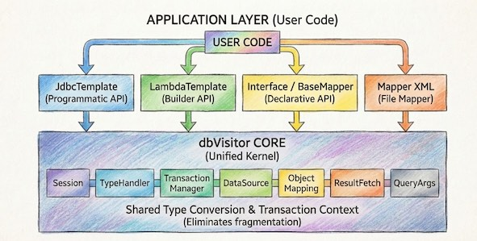

有开发者引用物理学隐喻：“粒子的位置与动量不可同时确定”，暗示在框架设计中，通用性与专用性难以兼得。
更有人直言，任何尝试“大一统”的框架，最终都会沦为“四不像”，不仅丢掉了数据库的强事务优势，也没能发挥出例如 Elasticsearch 的能力。

面对这些质疑，dbVisitor 依然坚定地提出了 **"One APIs Access Any DataBase"** 的愿景。
为什么我敢这么说？今天我们就来拆解这个争议，聊聊 dbVisitor 敢于挑战“大一统”的底气究竟在哪里。

<!-- truncate -->

## 一、我们对 API 的误解

要理解为什么 “大一统” 是可行的，我们首先需要厘清两个长期以来混淆视听的误区。

### 1. API 业务化

目前的 Java 数据库访问领域，出现了一种明显的趋势：API 越来越 **“业务化”**。

#### 什么是业务化？
为了解决特定领域的复杂查询问题，数据库访问框架开始追求极致的开发效率。
例如 [Easy-Query](https://www.easy-query.com/) 和 [SqlToy-ORM](https://gitee.com/sagacity/sagacity-sqltoy) 等优秀项目，**SqlToy-ORM** 在处理极致的分页优化、缓存翻译以及层次化数据查询（如递归查询）方面表现卓越，
往往能用极简的配置解决令人头秃的 SQL 难题；而 **Easy-Query** 则在类型安全的动态查询构建上做到了极致，让你在 Java 代码中就能以结构化的方式编写出极其复杂的业务逻辑。

*   **价值**：对于特定领域的复杂查询（如多表关联、动态聚合、行转列），它们甚至能通过很少的代码替代几十行原生 SQL。这种效率提升是巨大的，值得充分肯定。
*   **局限**：这种“神器”级别的 API 往往与数据库的特性强绑定。MySQL 的复杂查询逻辑，直接照搬到 MongoDB 或 Elasticsearch 上是完全行不通的。

#### dbVisitor 的选择：回归基座
回顾 Hibernate、MyBatis、Commons DBUtils 甚至 JDBC 本身，这些生命力持久的项目都有一个共性：**职责单一，目标明确**。它们不做业务逻辑，而是专注做 **基座**。

MyBatis Plus 在国内的巨大成功，正是建立在 MyBatis 这个坚实的“非业务化”基座之上。MyBatis 负责映射，MP 负责提供更高级的特性和封装。

**通用性的价值在于做“房屋的骨架”**。dbVisitor 的目标并非替代 Easy-Query 这类工具去解决具体业务的复杂查询，而是立志成为新时代的 **数据访问基座**。
只有基座稳固且统一，上层的业务生态（就像 MyBatis 生态）才能在不同数据源上百花齐放。

### 2. “简单模式无用论” 的谬误

反对者常由两个观点：
1.  **“CRUD 太简单，统一了也没价值”**
2.  **“统一 API 无法跨越数据库特性的鸿沟”**

#### 反驳观点一：简单 CRUD 的普世价值
如果你的世界里只有 MySQL 和 Oracle，那么非常确实，JDBC 已经统一了，再造轮子没意义。
但如果你的技术栈加入了 **MongoDB、Elasticsearch、Redis** 呢？
*   MongoDB 插入一条数据用 `db.collection.insertOne()`
*   Elasticsearch 插入一条数据用 `IndexRequest`
*   Redis 插入一条数据用 `set` 命令

这些“简单”的操作，API 风格天差地别。在 **"One APIs Access Any DataBase"** 的愿景下，能用统一的 `insert(entity)` 完成上述所有操作，本身就具有极高的普世价值，它消除了认知切换的成本。

#### 反驳观点二：API 不仅仅是查询构造器
这是一个巨大的思维误区：**“统一 API” 不等于 “统一成某一特定的接口”**。

- 查询构造器是不是 API？当然是！
- Mapper 接口（Dao）是不是 API？当然是！
- MyBatis 的 Mapper XML 绑定是不是 API？当然是！
- 底层的 `JDBC Connection` 是不是 API？更是！

人们鄙弃 Mapper + XML，往往是因为它写起来繁琐（重复劳动），但在架构层面，**Mapper 接口绑定 DSL** 是最符合 **“行为中心”** 的 API 设计。
它将“业务意图”（方法名）与“具体实现”（SQL/DSL）剥离。

只要我们不再执着于用 Java 代码去描述一切查询，而是接受 **“API 定义行为”** 这个理念，跨越数据库特性的鸿沟就可以迎刃而解。

## 二、dbVisitor 的核心思想

**没有灵丹妙药**，任何试图发明一种 “万能 Java 语法”来生成所有数据库查询的尝试，都注定失败。

dbVisitor 之所以敢说“可以”，是因为其核心思想并非去 **消灭差异** 寻求发明万能语法，
而是通过 **JDBC 标准化** 和 **分层抽象** 来 **管理差异**。并通过独特的双层适配器架构来弥合鸿沟：

#### JDBC 标准化
这层是 dbVisitor 达成 “One APIs Access Any DataBase” 愿景的根基。

*   **复用 JDBC 标准**：没有发明新协议，而是为 NoSQL（MongoDB, Elasticsearch, Redis）编写了遵循 JDBC 规范的驱动。
    并使用这些数据库官方原始的 DSL 语言来进行数据库操作。这些驱动在内部也仅仅是将 JDBC 的操作映射到各自的原生 SDK 调用上，并将返回值映射成 JDBC 标准方式。
*   **Request/Response 模型**：为了简化异构数据源的接入，复杂的 JDBC 状态管理被简化为轻量级的 Request/Response 模型。这使得你可以用很少的代码即可接入一个全新的非标准的数据源。 
    新的数据源，甚至直接被 **HikariCP** 管理。在使用它们的时候，除了查询语法不是 SQL 意外其它完全一致。

正是基于上述特征 dbVisitor 在进行适配 Elasticsearch 时只使用了约 20 个类，总共 2300 行代码，极其轻量。

#### One API

这里的 **“One API”** 并非指用一个死板的接口去涵盖一切，而是指构建 **一种统一的数据交互标准 (Unified Data Interaction Standard)**。
dbVisitor 的设计哲学认为，真正的统一不是强行把所有数据库操作都塞进同一个狭窄的入口，而是通过 **分层抽象** 在不同的维度上提供统一的体验。


dbVisitor 为不同的场景设计了不同级别的抽象接口，以应对不同的行为需求：

*   **LambdaQuery（屏蔽差异）**
    *   **应对场景**：80% 的日常增删改查。
    *   **优势**：这是 **最“大一统”** 的一层。它完全屏蔽了底层查询语言的差异，你只需要面向对象编程，无需关心底层是 MySQL 还是 NoSQL。

*   **Mapper / XML（管理差异）**
    *   **应对场景**：复杂的统计、聚合与关联查询。
    *   **优势**：这是 **最“兼容”** 的一层。它沿用了 MyBatis 的经典模式（Interface 定义行为 + XML 定义逻辑），允许你利用数据库原生的方言（SQL 或 JSON DSL）发挥其全部威力，而不是试图用 Java 模拟它们。

*   **JDBC Template（透传执行）**
    *   **应对场景**：数据库特有的管理命令或原生 Shell 脚本。
    *   **优势**：这是 **最“灵活”** 的一层。它允许你直接穿透框架，与底层的驱动进行对话，执行任何原生指令。

:::warning[统一 API ≠ 统一能力]
尽管 dbVisitor 统一了 insert/update/commit 等调用形式，但它不能改变底层数据库的物理特性。
对于 MongoDB、Elasticsearch 等弱事务或无事务的存储，调用 `commit()` 可能只是逻辑上的空操作，并不意味着具备了关系型数据库的 ACID 强一致性保障。
:::

## 三、实战：多维度的统一体验

让我们通过代码，看看这套理念是如何落地的。

### 1. 简单维度(类型安全)

无论底层是 MySQL 还是 Elasticsearch，标准的 CRUD 代码完全一致。

```java
// 统一的插入
template.insert(UserInfo.class)
        .applyEntity(new UserInfo("1001", "dbVisitor"))
        .executeSumResult();

// 统一的查询
List<UserInfo> list = template.lambdaQuery(UserInfo.class)
        .eq(UserInfo::getAge, 18)  // 自动翻译为 SQL / QueryDSL / Bson
        .list();
```

### 2. 业务维度（行为为中心）

当我们需要发挥 ES 的聚合能力或 MySQL 的复杂 Join 时，Mapper 接口是最佳选择。dbVisitor 提供了三种使用 Mapper 的姿势，你可以根据业务复杂度灵活混用。

#### 方式一：纯 Java 构建

这是 dbVisitor 一种方式，通过 **继承 BaseMapper** 并利用 Java 8 的 **default 方法**，你可以在 Mapper 接口内部直接使用查询构造器完成 DAL 逻辑。
这种方式既避免了 XML 的繁琐，又不像注解那样将 SQL 硬编码在 Java 文件中，完美实现了“零 SQL”开发。

```java
@SimpleMapper
public interface UserMapper extends BaseMapper<UserInfo> {

    // 纯 Java 代码构建查询逻辑，无需 XML 和 SQL
    default List<UserInfo> findActiveUsers(int minAge) {
        return this.query()
                   .eq(UserInfo::getStatus, "ENABLE")
                   .gt(UserInfo::getAge, minAge)
                   .list();
    }
}
```

#### 方式二：基于注解

对于中等复杂度的查询，直接在接口方法上使用注解是最简洁的方式。你无需编写额外的 XML 文件，即可完成 SQL 或 DSL 的绑定。

```java
@SimpleMapper
public interface UserMapper extends BaseMapper<UserInfo> {

    // 混合使用：MySQL 使用 SQL
    @Query("select * from user_info where age > #{age}")
    List<UserInfo> findByAge(@Param("age") int age);

    // 混合使用：Elasticsearch 使用 JSON DSL
    @Query("{\"bool\": {\"filter\": [ {\"term\": {\"age\": #{age}}} ]}}")
    List<UserInfo> searchByAge(@Param("age") int age);
    
    // 同时也支持 @Insert, @Update, @Delete 等标准注解
    @Insert("insert into user_info (name, age) values (#{name}, #{age})")
    int insertUser(@Param("name") String name, @Param("age") int age);
}
```

#### 方式三：基于 Mapper 文件

当 SQL 变得极度复杂（如几百行的报表 SQL），或者公司有严格的 DBA 审查流程（需分离 SQL 文件）时，XML 依然是不可替代的方案。

**Java 接口（定义行为）：**
```java
public interface UserMapper {
    // 这是一个业务意图：统计年龄分布
    List<Map<String, Object>> groupByAge(@Param("minAge") int minAge);
}
```

**XML 实现（定义逻辑）：**
这里展示了 dbVisitor 的强大之处：**在 XML 中写不同数据库的方言**。

```xml
<!-- 如果是 MySQL -->
<select id="groupByAge">
    SELECT age, count(*) FROM user_info WHERE age > #{minAge} GROUP BY age
</select>

<!-- 如果是 Elasticsearch (直接写 JSON DSL) -->
<select id="groupByAge">
    POST /user_info/_search
    {
        "query": { "range": { "age": { "gt": #{minAge} } } },
        "aggs": { "age_group": { "terms": { "field": "age" } } }
    }
</select>
```

### 3. 灵活维度：(原生体验)

这是 dbVisitor 的 **“逃生舱”**。当上层所有的抽象都无法满足你的特殊需求时，比如需要极致的性能优化、使用数据库特有的非标指令，或者集成 **QueryDSL** 等第三方框架，你可以退回到这层。

#### 场景一：原生 SQL/Shell 透传
直接下发数据库能识别的原生命令，无需任何转译。

```java
JdbcTemplate jdbc = new JdbcTemplate(connection);

// MySQL
jdbc.queryForList("select * from user where id = ?", 1);

// MongoDB (直接写 Mongo Shell)
jdbc.queryForList("db.user.find({_id: ?})", 1);
```

#### 场景二：底层 API 可达
你可以随时打破封装，直接操作底层的 `Connection`。对于 NoSQL 数据源，dbVisitor 的驱动层也遵循了 JDBC 的 `Wrapper` 规范，允许你 unwrap 出官方的原生驱动对象。

```java
// 获取标准 JDBC 接口
Connection conn = jdbcTemplate.getDataSource().getConnection();

// 如果需要，可以直接解包出底层的原生驱动对象（如 MongoClient）
if (conn.isWrapperFor(MongoClient.class)) {
    MongoClient client = conn.unwrap(MongoClient.class);
    // 直接调用官方 Driver 的 API
}
```

## 四、为何选择 dbVisitor？

很多人会问：“这不就是把 MyBatis 和 Spring 缝合了一下吗？” 其实并非如此。dbVisitor 不是简单的“胶水”，而是基于统一架构的**重新设计**。



### 1. 独立的双层适配能力
dbVisitor 是 **One API + Driver**。
即便你不打算替换现在的 MyBatis，你依然可以单独使用 dbVisitor 的 **JDBC Driver**。把它放入你的 Spring Boot + MyBatis 项目中，你的 MyBatis 立刻就具备了操作 MongoDB 和 Elasticsearch 的能力！
这是一种“降维打击”般的兼容性。

### 2. 底层架构的高度统一
如果你尝试过在项目中混用 MyBatis 和 Spring JDBC，你会发现割裂感很强：
*   MyBatis 的 `TypeHandler` 在 Spring JDBC 里用不了。
*   Spring 的 `RowMapper` 在 MyBatis 里无法复用。
*   事务管理器配合往往有坑。

JDBC Template、LambdaQuery、Mapper XML 全部共享同一套 **TypeHandler 机制**、同一套 **Session 管理**、同一套 **元数据映射**。
在 dbVisitor 中，你可以在 Lambda 查询中复用 Mapper 定义的 ResultMap，这种底层的一致性是简单的拼凑无法比拟的。

### 3. 生态框架的无关性

这是 dbVisitor 区别于 Spring Data 或 MyBatis-Plus 的另一个重要特征。
dbVisitor 的核心不依赖 Spring，也不依赖任何 Web 容器。它基于纯 Java (JDK 8+) 和 JDBC 标准构建。
这意味着：

* 你可以在 **Spring Boot** 中用它。
* 你可以在 **Solon**、**Vert.x**、**Quarkus** 中用它。
* 你甚至可以在一个没有任何依赖的 **Main 方法** 控制台程序中直接 `new` 出来使用它。

这种零耦合的特性，让它不仅能适应现有的各种技术栈，更能在未来的架构演进中保持生命力，不会被绑定在某个特定框架的战车上。

## 结语

物理学告诉我们要敬畏差异，但软件工程告诉我们要通过抽象来管理复杂。

dbVisitor 并不试图用“大一统”去掩盖数据库的特性，而是通过提供一个**统一的基座（JDBC Driver）**和**分层的 API 设计**，让开发者在简单场景享受“大一统”的便利，在复杂场景拥有“原生级”的掌控。

这就是 dbVisitor 敢于挑战数据访问“大一统”的底气。
