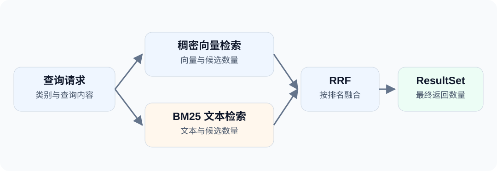

查技术文章时，有人输入概念描述，也有人输入准确的产品名。向量检索可以利用 embedding 表达的接近程度，关键词检索则保留词项匹配这条线索。

如果两条线索都需要，应该怎样组织查询？jdbc-milvus 提供 `ORDER BY HYBRID`，把多路检索和重排表达在一条命令里。

<!-- truncate -->



这不同于“标量过滤加向量排序”：后者只有一路向量候选，Hybrid 则组合多路候选。

## 集合结构 {#集合里保存什么}

示例为每篇文章保存正文、稠密向量和 BM25 输出字段：

```sql
CREATE TABLE blog_hybrid_articles (
    id INT64 PRIMARY KEY,
    category VARCHAR(32),
    body VARCHAR(1000) WITH (enable_analyzer=true),
    dense FLOAT_VECTOR(2),
    sparse SPARSE_FLOAT_VECTOR,
    FUNCTION bm25_fn USING BM25 (body) INTO (sparse)
) WITH (consistency_level='Strong');

CREATE INDEX idx_dense ON blog_hybrid_articles(dense)
USING AUTOINDEX WITH (metric_type='L2');

CREATE INDEX idx_sparse ON blog_hybrid_articles(sparse)
USING SPARSE_INVERTED_INDEX WITH (metric_type='BM25');
```

`body` 开启分词，BM25 函数负责生成 `sparse`。写入时传正文和 `dense`，不要自行填写函数输出 `sparse`。

```sql
INSERT INTO blog_hybrid_articles(id,category,body,dense) VALUES
(1,'java','milvus vector search',[1,0]),
(2,'java','mapper database guide',[0,1]),
(3,'python','milvus vector search',[1,0]);

FLUSH blog_hybrid_articles;
LOAD TABLE blog_hybrid_articles;
```

这里使用英文短文本，减少分词配置对入门示例的干扰；中文正文应选择合适的 analyzer。`FLUSH` 用在本次准备阶段，不应机械地放在每条业务写入之后。

二维稠密向量仍是演示数据。这篇验证的是混合查询链路，不是语义检索质量；真实业务需要用模型生成向量并评估召回效果。

## HYBRID 查询 {#一条-hybrid-查询}

```sql
SELECT id,body,score FROM blog_hybrid_articles
WHERE category = ?
ORDER BY HYBRID (
    dense <-> ? LIMIT 3,
    sparse <?> ? LIMIT 3
) LIMIT 2 WITH (reranker='rrf',k=60);
```

这条命令可以分成四步理解：

1. 两路查询都限定 `category`。
2. L2 检索最多取三个向量候选。
3. BM25 检索最多取三个文本候选。
4. Milvus 使用 RRF 融合候选，最终取两条结果。

RRF 依据候选排名融合，不是把 L2 距离与 BM25 分数直接相加。这里的 `k=60` 是 RRF 参数，不是候选数，也不是最终返回条数。计算方式见 [Milvus RRF 说明](https://milvus.io/docs/v2.6.x/rrf-ranker.md)。

## JDBC 参数绑定 {#jdbc-参数怎样传}

```java
try (PreparedStatement search = conn.prepareStatement("""
        SELECT id,body,score FROM blog_hybrid_articles
        WHERE category = ? ORDER BY HYBRID (
            dense <-> ? LIMIT 3,
            sparse <?> ? LIMIT 3
        ) LIMIT 2 WITH(reranker='rrf',k=60)
        """)) {
    search.setString(1, "java");
    search.setObject(2, new float[] {1, 0});
    search.setString(3, "milvus");
    try (ResultSet rows = search.executeQuery()) {
        while (rows.next()) {
            System.out.println(rows.getLong("id") + " | "
                    + rows.getString("body") + " | " + rows.getDouble("score"));
        }
    }
}
```

示例中第一条结果是 ID 1，它同时出现在两路检索中；ID 3 因类别不符不会返回。结果是**一个** `ResultSet`，不是让 Java 代码再合并两份列表。此时 `score` 是重排分数，不再是原始 L2 距离。

:::note[使用 JdbcTemplate 时]
上面是直接 JDBC 调用，操作符 `<?>` 不需要转义。如果通过 dbVisitor 的 JdbcTemplate 传位置参数，Java 字符串中应写成 `sparse <\\?> ?`，避免其参数扫描把操作符中的问号当成参数。详见 [参数标记转义](/docs/guides/args/escape)。
:::

## 候选量与重排 {#调整时先看三个数量}

每路的 LIMIT 控制候选量；最外层 LIMIT 控制输出量；`k` 调整 RRF 对名次差异的权重。不要把它们当成同一个“Top K”。

如果希望显式配置两路权重，可以选择 Weighted rerank；权重与路数必须对应。选择哪种方式应由业务查询样本决定，不能仅凭这几条演示数据得出检索质量结论。

Hybrid 通过原生 `hybridSearch` 执行，`fetchSize` 不会把它变成无上限的融合结果迭代器。详细参数见 [HYBRID 语法](/docs/features/milvus/sql/hybrid)。

**动手运行：**示例工程（[GitHub](https://github.com/zycgit/dbvisitor/tree/main/dbvisitor-example/blog-680) / [Gitee](https://gitee.com/zycgit/dbvisitor/tree/main/dbvisitor-example/blog-680)），执行 `example.MilvusHybrid`。它包含建集合、索引、写入、检索与清理，不需要外部 embedding 服务。

下一步可以阅读 [数据入库方式选择](/blog/milvus-data-ingestion)，把检索入口与数据写入流程接起来。
