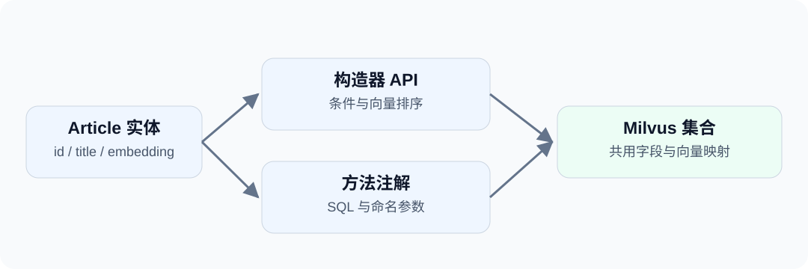

第一次向量查询跑通后，业务代码通常还需要一个稳定的入口：新增文章、按类别检索、修改标题。每个调用方都去处理 `ResultSet`，并不是唯一选择。

这一篇在 jdbc-milvus 之上使用 dbVisitor，把集合映射为实体，再把操作收进一个 Mapper 接口。调用方只需要知道业务方法，不必重复处理列名和结果转换。

<!-- truncate -->



## 实体映射 {#从集合到实体}

在 [JDBC 入门篇](/blog/milvus-jdbc-vector-search)的驱动依赖之外，再引入：

```xml
<dependency>
    <groupId>net.hasor</groupId>
    <artifactId>dbvisitor</artifactId>
    <version>6.8.0</version>
</dependency>
```

示例使用独立集合 `blog_dao_articles`，字段仍为 `id`、`title`、`category`、`embedding`。完整工程会创建集合、L2 索引并加载，不需要复制上一篇的数据。

```java
@Table("blog_dao_articles")
public class Article {
    @Column(primary = true)
    private Long id;
    private String title;
    private String category;
    private List<Float> embedding;
    // 标准 getter、setter，完整源码中已提供。
}
```

`@Table`、`@Column` 来自 `net.hasor.dbvisitor.mapping`。这里主键由应用赋值；Milvus 的 `FLOAT_VECTOR(2)` 可以直接映射为 `List<Float>`，不需要 PostgreSQL 的向量处理器。

## 构造器写入 {#用构造器写入}

```java
Article article = new Article();
article.setId(1L);
article.setTitle("Vector introduction");
article.setCategory("java");
article.setEmbedding(List.of(1F, 0F));

LambdaTemplate lambda = new LambdaTemplate(conn);
lambda.insert(Article.class).applyEntity(article).executeSumResult();
```

`LambdaTemplate` 来自 `net.hasor.dbvisitor.lambda`。它依据映射生成 INSERT，驱动再交给 Milvus 写入。实体不会因为添加了 `@Table` 就自动创建集合。

## Mapper 检索 {#把检索收进-mapper}

Mapper 可以继承 `BaseMapper<Article>`，并在默认方法里调用构造器：

```java
@SimpleMapper
public interface ArticleMapper extends BaseMapper<Article> {
    default List<Article> nearest(String category, List<Float> vector)
            throws SQLException {
        return query()
                .eq(Article::getCategory, category)
                .orderByL2(Article::getEmbedding, vector)
                .initPage(2, 0)
                .queryForList();
    }
}
```

`BaseMapper`、`SimpleMapper` 来自 `net.hasor.dbvisitor.mapper`。`initPage(2, 0)` 表示从第 0 页取两条记录；对于这次向量搜索，就是选取最近的两个结果，不是在查询完整集合后由 Java 排序。

使用已经打开的 JDBC 连接创建 Session：

```java
try (Session session = new Configuration().newSession(conn)) {
    ArticleMapper mapper = session.createMapper(ArticleMapper.class);
    List<Article> articles = mapper.nearest("java", List.of(1F, 0F));
    System.out.println(articles.get(0).getTitle());

    mapper.update()
            .eq(Article::getId, 1L)
            .updateTo(Article::getTitle, "Revised guide")
            .doUpdate();
    Article loaded = mapper.selectById(1L);
    System.out.println(loaded.getTitle());      // Revised guide
    System.out.println(loaded.getEmbedding()); // [1.0, 0.0]
}
```

`Session` 和 `Configuration` 来自 `net.hasor.dbvisitor.session`。

## 方法注解 {#更喜欢-sql使用方法注解}

同一个接口也可以声明：

```java
@Query("""
        SELECT id,title,category,embedding FROM blog_dao_articles
        WHERE category = #{category}
        ORDER BY embedding <-> #{vector} LIMIT 2
        """)
List<Article> search(@Param("category") String category,
                     @Param("vector") List<Float> vector);
```

`@Query` 与 `@Param` 同样来自 `net.hasor.dbvisitor.mapper`。调用 `mapper.search("java", List.of(1F, 0F))` 得到的仍是实体列表。

构造器适合在代码中组织条件；方法注解适合简短、稳定的查询。两者不必二选一，长命令还可以放进 Mapper 文件。

## 局部更新 {#修改标题不重写向量}

上面的 `mapper.update()` 与查询在同一个 Session 内执行：只修改 `title`，`embedding` 仍为 `[1.0, 0.0]`。这些调用都应在 try 块结束前完成；关闭基于 Connection 创建的 Session 时，该 Connection 也会关闭。

驱动选取匹配主键后，使用原生 Partial Update 提交修改字段。这个例子只更新标题，不需要先读回向量再提交完整实体。

:::note
部分字段更新不等于事务或乐观锁。多个请求修改同一字段时仍需业务处理并发；多页更新失败后，已经成功的页面不会自动回滚。
:::

## 适用场景 {#什么时候值得用这一层}

当多处代码都要读取相同实体，或者希望把检索封装为业务方法时，对象映射与 Mapper 能减少重复代码。只执行几条管理命令时，直接 JDBC 就足够了。

示例工程（[GitHub](https://github.com/zycgit/dbvisitor/tree/main/dbvisitor-example/blog-680) / [Gitee](https://gitee.com/zycgit/dbvisitor/tree/main/dbvisitor-example/blog-680)），运行 `example.MilvusDao`，可以观察两种查询方式及标题更新后的结果。更复杂的多路召回见下一篇 [Milvus 混合检索实战](/blog/milvus-hybrid-search)。

完整用法：[API 选择指南](/docs/guides/api/about) · [Milvus 向量操作](/docs/features/milvus/vectors) · [数据写入](/docs/features/milvus/write)。
