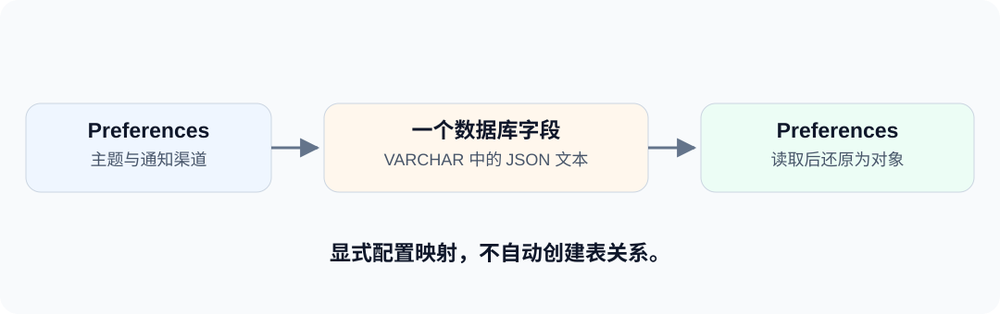

主题颜色、通知渠道等用户偏好，通常一起读取、一起修改。如果每次都手工把对象序列化成 JSON，再在查询后反序列化，这段转换逻辑很容易散落在多个 DAO 中。

dbVisitor 可以把这项约定写到类型上：一个 Java 对象，对应数据库里的一个字段值。

<!-- truncate -->



## 存储结构 {#先把存储目标说清楚}

本文使用 H2 内存数据库，避免准备外部服务。表结构为：

```sql
CREATE TABLE blog_user_profile (
    id INT PRIMARY KEY,
    preferences VARCHAR(2000),
    attributes VARCHAR(2000)
);
```

`preferences` 保存偏好对象，`attributes` 保存 Map。`VARCHAR(2000)` 只是足够容纳示例 JSON 的文本列，**不会因为字段名或长度而自动映射成对象**。

示例依赖 dbVisitor、H2 和 Gson；可直接运行 示例工程（[GitHub](https://github.com/zycgit/dbvisitor/tree/main/dbvisitor-example/blog-680) / [Gitee](https://gitee.com/zycgit/dbvisitor/tree/main/dbvisitor-example/blog-680)）中的 `example.JsonField`。

## 类型注解 {#业务类推荐使用类型注解}

```java
@BindTypeHandler(JsonTypeHandler.class)
public class Preferences {
    private String theme;
    private List<String> channels;
    // 标准 getter、setter。
}
```

注解来自 `net.hasor.dbvisitor.types.BindTypeHandler`，处理器来自 `net.hasor.dbvisitor.types.handler.json.JsonTypeHandler`。它声明的是 Preferences 的值转换方式，不是表映射。

外层实体再描述列与属性关系：

```java
@Table("blog_user_profile")
public class UserProfile {
    @Column(primary = true)
    private Integer id;
    private Preferences preferences;

    @Column(typeHandler = JsonTypeHandler.class,
            specialJavaType = LinkedHashMap.class)
    private Map<String, Object> attributes;
    // 标准 getter、setter。
}
```

Preferences 可以在自身类型上加注解，不必在每个属性上重复配置。Map 不能这样做，所以在属性的 `@Column` 上声明处理器，并指定读取时使用 `LinkedHashMap`。

## 对象读写 {#写入后再读回对象}

```java
Preferences prefs = new Preferences();
prefs.setTheme("dark");
prefs.setChannels(List.of("email", "app"));

UserProfile profile = new UserProfile();
profile.setId(1);
profile.setPreferences(prefs);
profile.setAttributes(Map.of("language", "zh-CN"));

LambdaTemplate lambda = new LambdaTemplate(conn);
lambda.insert(UserProfile.class).applyEntity(profile).executeSumResult();

UserProfile loaded = lambda.query(UserProfile.class)
        .eq(UserProfile::getId, 1)
        .queryForObject();
```

`loaded.getPreferences().getTheme()` 为 `dark`，渠道列表是 `[email, app]`，`loaded.getAttributes().get("language")` 为 `zh-CN`。

数据库 `preferences` 字段保存类似下面的文本，JSON 属性顺序不影响含义：

```json
{"theme":"dark","channels":["email","app"]}
```

## 整字段更新 {#更新的是整个字段}

```java
loaded.getPreferences().setTheme("light");
lambda.update(UserProfile.class)
        .eq(UserProfile::getId, 1)
        .updateTo(UserProfile::getPreferences, loaded.getPreferences())
        .doUpdate();
```

内存里的修改需要显式提交。上面的 UPDATE 会将新的 Preferences 整体序列化，不会自动生成仅修改 `theme` 的 JSON 路径表达式。

如果多个请求分别修改 JSON 的不同属性，也不能由此推断更新会自动合并。需要数据库原生局部更新或并发控制时，应单独设计写入语句。

## 适用范围 {#什么时候适合这样映射}

适合小型配置、扩展信息等通常整体读写的数据。如果经常按内部属性排序、筛选或关联，应考虑独立列，或者使用数据库自己的 JSON 查询语法。

类型处理器负责 Java 值和 JSON 文本的转换，不决定数据库原生 JSON 类型如何绑定。换成 PostgreSQL JSONB 等类型时，需要继续核对该数据源的用法，不能直接认为所有字段类型都与 VARCHAR 相同。

完整例子使用 Gson。已有项目可以使用受支持的 Jackson、Gson 或其它 JSON 库，选择方式见 [JSON 序列化处理器](/docs/guides/types/json-serialization)。业务映射参考 [JSON 字段映射](/docs/guides/core/mapping/json-field)。

希望把同一约定用于缓存？可以接着看 [Redis 商品缓存](/blog/redis-mapper-cache)：对象仍然是 JSON，但存储位置变成了 Redis String。
