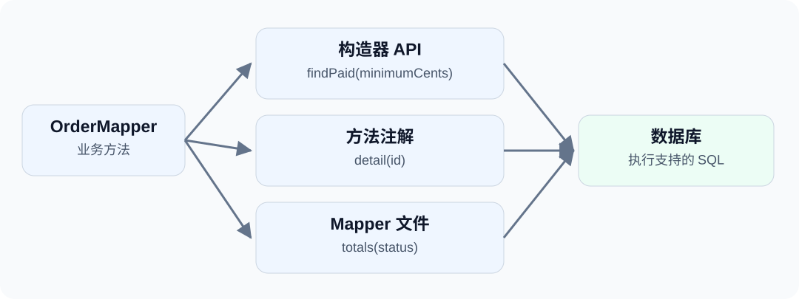

选择数据访问方式时，并不一定要在“全部写 Lambda”和“全部写 XML”之间做决定。

以订单模块为例：带条件的列表适合构造器；按 ID 查询只有一行 SQL；统计报表需要更明确地维护语句。dbVisitor 允许这三种写法放在同一个 Mapper 接口里。

<!-- truncate -->



## 方法分工 {#按业务方法分工}

| 业务方法 | 写法 | 原因 |
| --- | --- | --- |
| findPaid(minimumCents) | 构造器 API | 条件与 Java 属性直接对应 |
| detail(id) | 方法注解 | 简短稳定的查询就近维护 |
| totals(status) | Mapper 文件 | 统计 SQL 集中维护，后续易于扩展 |

这不是将同一个查询写三遍，而是让每个方法选择适合自己的表达方式。

## 实体与数据 {#准备实体与数据}

示例使用 H2 内存数据库，金额用整数分表示：

```sql
CREATE TABLE blog_orders (
    id INT PRIMARY KEY,
    status VARCHAR(20),
    amount_cents BIGINT
);
INSERT INTO blog_orders VALUES
(1,'PAID',1000),(2,'PAID',2000),(3,'NEW',5000);
```

```java
@Table("blog_orders")
public class Order {
    @Column(primary = true)
    private Integer id;
    private String status;
    @Column("amount_cents")
    private Long amountCents;
    // 标准 getter、setter。
}
```

完整工程包含依赖、import 和访问器，可以直接运行 `example.ApiStyles`。

## 组合三种调用 {#一个接口组织三种调用}

```java
@RefMapper("/mapper/orders.xml")
public interface OrderMapper extends BaseMapper<Order> {
    default List<Order> findPaid(long minimumCents) throws SQLException {
        return query()
                .eq(Order::getStatus, "PAID")
                .ge(Order::getAmountCents, minimumCents)
                .orderBy(Order::getId)
                .queryForList();
    }

    @Query("SELECT * FROM blog_orders WHERE id = #{id}")
    Order detail(@Param("id") int id);

    List<Map<String, Object>> totals(@Param("status") String status);
}
```

`BaseMapper`、`RefMapper`、`Query`、`Param` 来自 `net.hasor.dbvisitor.mapper`。

默认方法复用 `BaseMapper` 的 `query()`；`detail` 的命令来自注解；`totals` 的命令来自 `@RefMapper` 指定的资源文件。不需要把三者拆成互不相关的 DAO。

## XML 统计查询 {#把统计查询放进-xml}

示例为了便于下载，将接口放在 `ApiStyles` 的静态内部类中，所以 namespace 使用其二进制名称 `example.ApiStyles$OrderMapper`。实际项目使用顶层接口时填写正常的全限定名，例如 `com.example.OrderMapper`。

`src/main/resources/mapper/orders.xml`：

```xml
<?xml version="1.0" encoding="UTF-8"?>
<!DOCTYPE mapper PUBLIC "-//dbvisitor.net//DTD Mapper 1.0//EN"
        "https://www.dbvisitor.net/schema/dbvisitor-mapper.dtd">
<mapper namespace="example.ApiStyles$OrderMapper">
    <select id="totals" resultType="java.util.LinkedHashMap">
        SELECT status AS "status", SUM(amount_cents) AS "total_cents"
        FROM blog_orders
        WHERE status = #{status}
        GROUP BY status
    </select>
</mapper>
```

XML 的 `id` 对应接口方法名。命令使用的是示例数据库支持的 SQL；`@RefMapper` 不会把 GROUP BY 自动转换成任意数据源都能执行的命令。

## 调用 Mapper {#调用方只面对-mapper}

```java
try (Session session = new Configuration().newSession(conn)) {
    OrderMapper mapper = session.createMapper(OrderMapper.class);
    List<Order> orders = mapper.findPaid(1500);          // ID 2
    Order detail = mapper.detail(1);                     // amountCents = 1000
    List<Map<String, Object>> totals = mapper.totals("PAID"); // total_cents = 3000
}
```

三种调用使用同一个 Session。绑定 Connection 的 Session 关闭时会关闭该连接，示例将它们放在统一的资源作用域中，不在关闭后继续使用连接。

需要事务时，应使用数据源支持的事务与框架事务管理方式；把方法放进一个接口本身并不会开启事务。

## 写法选择 {#不必为了风格统一改写所有代码}

选择可以很简单：属性条件查询先用构造器，短语句用方法注解，长 SQL 放 Mapper 文件。已有语句适合继续使用时，也可以通过 JdbcTemplate 执行。

统一的是调用入口、参数与映射等基础能力，不是要求每段查询都长得一样。

**试一试：**示例工程（[GitHub](https://github.com/zycgit/dbvisitor/tree/main/dbvisitor-example/blog-680) / [Gitee](https://gitee.com/zycgit/dbvisitor/tree/main/dbvisitor-example/blog-680)），运行 `example.ApiStyles`，无需额外数据库服务。更多组合方式见 [API 选择指南](/docs/guides/api/about)和 [调用文件 Mapper](/docs/guides/core/mapper/file_statement)。
