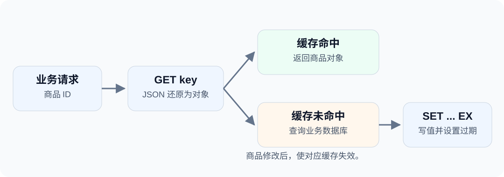

---
last_update:
  date: 2026-09-17
slug: redis-mapper-cache
topics: [datasources]
title: "Mapper 实战：Redis 商品缓存读写"
description: 使用 dbVisitor Mapper 调用 Redis 命令，将商品对象映射成 JSON，完成带过期时间的缓存读写和失效处理。
authors: [ZhaoYongChun]
tags: [dbVisitor, Redis, JDBC]
---

Redis 没有关系型表，怎么会和 Mapper 放在一起？关键不是把 Redis 变成 SQL 数据库，而是复用 Java 接口、参数绑定和结果映射。

例如，一个商品缓存接口可以只有三个业务方法：`save`、`load`、`evict`。方法背后执行的仍是 Redis 的 SET、GET 和 DEL。

<!-- truncate -->



## 缓存结构 {#先看缓存长什么样}

Redis 键是 `demo:cache:product:p1001`，String 值保存商品摘要：

```json
{"productId":"p1001","name":"USB-C Hub","priceCents":12900}
```

这里选择整数分表示价格，并设置 300 秒有效期。它是可丢失、可重新生成的缓存，不是商品的唯一存储。

## 连接 Redis

引入 `net.hasor:dbvisitor:6.8.0`、`net.hasor:jdbc-redis:6.8.0:all`。JSON 映射还需要一个受支持的 JSON 库，示例工程使用 Gson。

```java
Properties props = new Properties();
// 开启认证时，从应用配置中读取密码：
// props.setProperty("password", System.getenv("REDIS_PASSWORD"));
try (Connection conn = DriverManager.getConnection(
        "jdbc:dbvisitor:jedis://127.0.0.1:6379?database=0", props);
        Session session = new Configuration().newSession(conn)) {
    // 创建并调用 Mapper。
}
```

驱动名称是 `jdbc-redis`，URL 前缀是 **jedis**。数据库编号使用 `database` 参数。完整依赖和 import 均包含在 示例工程（[GitHub](https://github.com/zycgit/dbvisitor/tree/main/dbvisitor-example/blog-680) / [Gitee](https://gitee.com/zycgit/dbvisitor/tree/main/dbvisitor-example/blog-680)） 中。

## 对象映射 {#mapping一个对象保存为一个值}

```java
@BindTypeHandler(JsonTypeHandler.class)
public class Product {
    private String productId;
    private String name;
    private Long priceCents;
    // 标准 getter、setter。
}
```

`BindTypeHandler` 来自 `net.hasor.dbvisitor.types`，`JsonTypeHandler` 来自 `net.hasor.dbvisitor.types.handler.json`。

这里不配置 `@Table`：Product 整体映射为 Redis String 中的 JSON，不把 `name`、`priceCents` 拆成表字段，也不隐式生成 Hash 命令。

## Mapper 命令 {#mapper命令就是执行内容}

```java
@SimpleMapper
public interface ProductCacheMapper {
    @Insert("SET #{key} #{product} EX #{seconds}")
    int save(@Param("key") String key,
             @Param("product") Product product,
             @Param("seconds") int seconds);

    @Query("GET #{key}")
    Product load(@Param("key") String key);

    @Delete("DEL #{key}")
    int evict(@Param("key") String key);
}
```

这些注解来自 `net.hasor.dbvisitor.mapper`。注解名虽然叫 `@Insert`，里面不必写 INSERT；驱动会执行支持的 Redis 命令。

`#{product}` 通过类型处理器转成 JSON 参数。GET 返回后，又根据目标类型还原 Product。无需手工给 JSON 添加命令引号。

## 写入、命中与失效

```java
ProductCacheMapper mapper = session.createMapper(ProductCacheMapper.class);
String key = "demo:cache:product:p1001";

Product product = new Product();
product.setProductId("p1001");
product.setName("USB-C Hub");
product.setPriceCents(12900L);

mapper.save(key, product, 300);
Product cached = mapper.load(key);
System.out.println(cached.getName());       // USB-C Hub
System.out.println(cached.getPriceCents()); // 12900

mapper.evict(key);
System.out.println(mapper.load(key));       // null
```

SET 同时设置值和过期时间，避免分成“写值成功、设置过期失败”两个步骤。再次 save 会覆盖整个缓存值，并重新设置有效期。

缓存未命中时，由业务查询主数据库，再调用 save。商品修改成功后使对应缓存失效。这个示例不是跨数据库和 Redis 的事务方案，也不自动解决缓存击穿、并发回填旧值等问题。

## Redis 语义 {#接入后哪些东西没有变}

Redis 的键、数据结构和过期语义没有变；变化的是 Java 代码如何组织这些命令。短命令放在方法注解中，业务调用方依赖 Mapper 接口，对象转换交给 Mapping。

这也是 dbVisitor 对原生命令的处理方式：SQL、Redis 命令、MongoDB 命令都可以作为执行内容，但只能使用相应驱动支持的语法。

**运行完整例子：**`example.RedisCache` 会使用独立演示键，显示未命中、命中、TTL 和删除后的结果，并清理该键。没有执行 FLUSHDB 或清空业务数据库的操作。

更多场景：[商品缓存](/docs/features/redis/scenarios/product-cache) · [购物车](/docs/features/redis/scenarios/shopping-cart) · [积分排行](/docs/features/redis/scenarios/points-ranking)。
