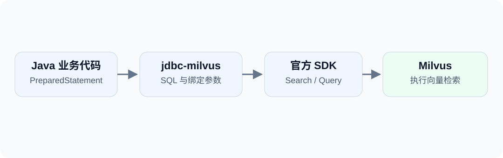

如果项目已经使用 Java 和 JDBC，接入 Milvus 后，能不能继续用 `PreparedStatement` 传参数、用 `ResultSet` 读取结果？

`jdbc-milvus` 提供了这样的入口。比如，下面的命令是在文章类别中查找与给定向量最接近的两条记录：

```sql
SELECT id, title, score FROM blog_jdbc_articles
WHERE category = ?
ORDER BY embedding <-> ? LIMIT 2;
```

第一个参数是类别，第二个参数是向量。你仍然需要理解向量检索，但不用为这次查询重新组织一套 Java 调用方式。

<!-- truncate -->

## 独立 JDBC 驱动 {#一个可以独立使用的驱动}



`jdbc-milvus` 将支持的 SQL 风格命令转换为官方 SDK 调用。普通条件查询使用 Query，向量检索使用 Search；计算仍由 Milvus 完成。

它不要求业务代码使用 dbVisitor 的构造器或 Mapper。先独立使用 JDBC，之后再按需要引入对象映射，是一条可行的接入路径。

:::note
这里的 SQL 是驱动提供的命令语言，不是 Milvus 服务端新增了 SQL 协议，也不表示支持任意 MySQL 或 PostgreSQL 语句。
:::

## 依赖与连接 {#引入依赖并连接}

```xml
<dependency>
    <groupId>net.hasor</groupId>
    <artifactId>jdbc-milvus</artifactId>
    <version>6.8.0</version>
    <classifier>all</classifier>
</dependency>
```

本文示例以 dbVisitor 6.8.0 和 Milvus 2.6.x 为基础，服务端最低要求 2.6.2。

```java
Properties props = new Properties();
props.setProperty("consistencyLevel", "Strong");
// 开启认证时配置 token，不要将密钥写进源码或 URL。
// props.setProperty("token", System.getenv("MILVUS_TOKEN"));

try (Connection conn = DriverManager.getConnection(
        "jdbc:dbvisitor:milvus://127.0.0.1:19530/default", props)) {
    // 执行下面的建表、写入与检索代码。
}
```

`Connection`、`DriverManager` 等来自 `java.sql`，`Properties` 来自 `java.util`。完整源码包含所有 import。

使用 Zilliz Cloud 时，配置控制台给出的主机、端口、数据库和凭据，并启用 `secure=true`。详细配置见 [Zilliz Cloud 连接](/docs/drivers/milvus/connection#cloud)。

## 集合与索引 {#先准备集合与索引}

示例只保存 ID、标题、类别和一个二维向量：

```sql
CREATE TABLE blog_jdbc_articles (
    id INT64 PRIMARY KEY,
    title VARCHAR(256),
    category VARCHAR(32),
    embedding FLOAT_VECTOR(2)
) WITH (consistency_level='Strong');

CREATE INDEX idx_embedding ON blog_jdbc_articles(embedding)
USING AUTOINDEX WITH (metric_type='L2');

LOAD TABLE blog_jdbc_articles;
```

通过 `Statement.executeUpdate()` 分别执行三条命令。`CREATE TABLE` 创建 Milvus Collection，`FLOAT_VECTOR(2)` 要求每个向量有两个分量。索引采用 L2 度量，后面的 `<->` 检索与它保持一致。

集合设置 Strong 是为了示例写入后立即查询；对于使用迭代器的读取，不能只依赖连接上的一致性参数。

## 参数化写入 {#把向量作为参数写入}

```java
String sql = """
        INSERT INTO blog_jdbc_articles(id,title,category,embedding)
        VALUES (?,?,?,?)
        """;
try (PreparedStatement insert = conn.prepareStatement(sql)) {
    insert.setLong(1, 1L);
    insert.setString(2, "Vector introduction");
    insert.setString(3, "java");
    insert.setObject(4, new float[] {1, 0});
    insert.executeUpdate();
}
```

不需要手工拼接向量字符串。`FLOAT_VECTOR` 可以接收 `float[]` 或数值列表，长度应与集合定义一致。

完整示例写入以下三条数据：

| id | title | category | embedding |
| --- | --- | --- | --- |
| 1 | Vector introduction | java | [1, 0] |
| 2 | Mapper guide | java | [0, 1] |
| 3 | Other category | python | [1, 0] |

这些是帮助理解排序的演示向量，不是由标题生成的语义向量。真正的文本检索需要使用合适的 embedding 模型，并让文档和查询使用匹配的模型及维度。

## 检索与结果读取 {#查询并读取结果}

```java
try (PreparedStatement search = conn.prepareStatement("""
        SELECT id,title,score FROM blog_jdbc_articles
        WHERE category = ? ORDER BY embedding <-> ? LIMIT 2
        """)) {
    search.setString(1, "java");
    search.setObject(2, new float[] {1, 0});
    try (ResultSet rows = search.executeQuery()) {
        while (rows.next()) {
            System.out.println(rows.getLong("id") + " | "
                    + rows.getString("title") + " | " + rows.getFloat("score"));
        }
    }
}
```

输出为：

```text
1 | Vector introduction | 0.0
2 | Mapper guide | 2.0
```

第三条向量虽然也完全匹配，却因为类别不同被过滤掉。这里 `score` 是 Milvus 返回的 L2 分数，即平方欧氏距离，越小越接近；它不是百分比。换成其它度量时，应按对应度量解释分数。

## 能力边界 {#用熟悉的入口保留数据库的特点}

JDBC 带来了参数绑定和结果读取方式的复用，并没有让 Milvus 变成关系型数据库：不支持 JDBC Batch、事务和 JOIN，分页写入也不保证跨页回滚。

其它能力可以在需要时再学习：多种向量类型、Hybrid Search、BM25、主键回传、集合管理与 Import。完整范围见 [Milvus 命令参考](/docs/features/milvus/about)。

**开始尝试：**示例工程（[GitHub](https://github.com/zycgit/dbvisitor/tree/main/dbvisitor-example/blog-680) / [Gitee](https://gitee.com/zycgit/dbvisitor/tree/main/dbvisitor-example/blog-680)），运行 `example.MilvusJdbc`。工程会创建自己的演示集合，并在结束时清理；请使用测试数据库。

如果希望把结果直接映射成实体，下一篇继续看 [Milvus 实体映射与 DAO 封装](/blog/milvus-vector-dao)。
