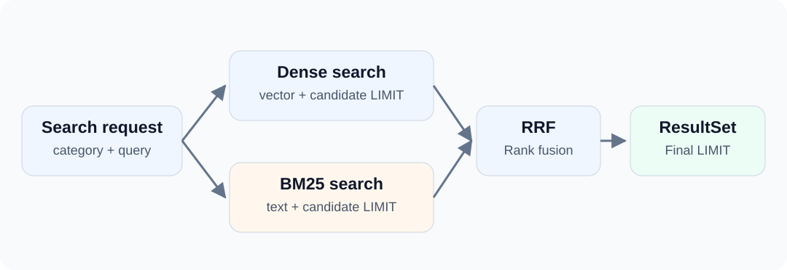

People search technical articles using both conceptual descriptions and exact product names. Embeddings provide one retrieval signal; keyword matches provide another.

When you need both, jdbc-milvus offers ORDER BY HYBRID to express retrieval paths and reranking in one command.

<!-- truncate -->



This is different from a scalar filter plus vector ordering: that is one retrieval path; Hybrid combines several candidate lists.

## Collection Schema {#what-the-collection-stores}

Each article has text, a dense vector and a BM25 output field:

```sql
CREATE TABLE blog_hybrid_articles (
    id INT64 PRIMARY KEY,
    category VARCHAR(32),
    body VARCHAR(1000) WITH (enable_analyzer=true),
    dense FLOAT_VECTOR(2),
    sparse SPARSE_FLOAT_VECTOR,
    FUNCTION bm25_fn USING BM25 (body) INTO (sparse)
) WITH (consistency_level='Strong');

CREATE INDEX idx_dense ON blog_hybrid_articles(dense)
USING AUTOINDEX WITH (metric_type='L2');

CREATE INDEX idx_sparse ON blog_hybrid_articles(sparse)
USING SPARSE_INVERTED_INDEX WITH (metric_type='BM25');
```

The body field enables analysis, and the BM25 function generates sparse. Insert body and dense; do not manually populate the function's sparse output.

```sql
INSERT INTO blog_hybrid_articles(id,category,body,dense) VALUES
(1,'java','milvus vector search',[1,0]),
(2,'java','mapper database guide',[0,1]),
(3,'python','milvus vector search',[1,0]);

FLUSH blog_hybrid_articles;
LOAD TABLE blog_hybrid_articles;
```

Short English texts keep analyzer configuration out of the introductory example. Choose an appropriate analyzer for Chinese or other content. FLUSH is used in this preparation phase, not as a step to repeat after every business write.

The two-dimensional dense vectors are demonstration data. This verifies the hybrid-query workflow, not semantic search quality. Real applications need model-generated vectors and retrieval evaluation.

## HYBRID Query {#one-hybrid-query}

```sql
SELECT id,body,score FROM blog_hybrid_articles
WHERE category = ?
ORDER BY HYBRID (
    dense <-> ? LIMIT 3,
    sparse <?> ? LIMIT 3
) LIMIT 2 WITH (reranker='rrf',k=60);
```

Read the command as four steps:

1. Apply the category filter to both paths.
2. Retrieve up to three L2 candidates.
3. Retrieve up to three BM25 candidates.
4. Fuse their rankings with RRF and return two results.

RRF combines candidate ranks rather than directly adding L2 distances to BM25 scores. Its k=60 is a reranking parameter, not the candidate count or final result limit. See the [Milvus RRF explanation](https://milvus.io/docs/v2.6.x/rrf-ranker.md).

## JDBC Parameter Binding {#bind-jdbc-parameters}

```java
try (PreparedStatement search = conn.prepareStatement("""
        SELECT id,body,score FROM blog_hybrid_articles
        WHERE category = ? ORDER BY HYBRID (
            dense <-> ? LIMIT 3,
            sparse <?> ? LIMIT 3
        ) LIMIT 2 WITH(reranker='rrf',k=60)
        """)) {
    search.setString(1, "java");
    search.setObject(2, new float[] {1, 0});
    search.setString(3, "milvus");
    try (ResultSet rows = search.executeQuery()) {
        while (rows.next()) {
            System.out.println(rows.getLong("id") + " | "
                    + rows.getString("body") + " | " + rows.getDouble("score"));
        }
    }
}
```

ID 1 comes first in this example and appears in both retrieval paths. ID 3 is excluded by category. There is **one** ResultSet; Java does not merge two lists. The score is now a reranking score, not an original L2 distance.

:::note[When using JdbcTemplate]
The example calls JDBC directly, so the `<?>` operator does not need escaping. With dbVisitor JdbcTemplate and positional parameters, write `sparse <\\?> ?` in the Java string so parameter scanning does not treat the operator's question mark as a parameter. See [Escaping parameter markers](/docs/guides/args/escape).
:::

## Limits and Reranking {#keep-three-quantities-separate}

Each inner LIMIT controls its candidate count. The outer LIMIT controls the output count. The RRF k parameter adjusts sensitivity to rank differences.

Weighted reranking is another option when you want explicit branch weights; provide one weight per path. Choose using representative business queries, not these few demonstration records.

Hybrid uses the native hybridSearch API. fetchSize does not turn it into an unlimited iterator. See the [HYBRID reference](/docs/features/milvus/sql/hybrid).

**Run it:** open the example project ([GitHub](https://github.com/zycgit/dbvisitor/tree/main/dbvisitor-example/blog-680) / [Gitee](https://gitee.com/zycgit/dbvisitor/tree/main/dbvisitor-example/blog-680)) and execute example.MilvusHybrid. It includes schema, indexes, writes, retrieval and cleanup, without an external embedding service.

Continue with [Choosing a Milvus ingestion workflow](/blog/milvus-data-ingestion) to connect retrieval to data ingestion.
