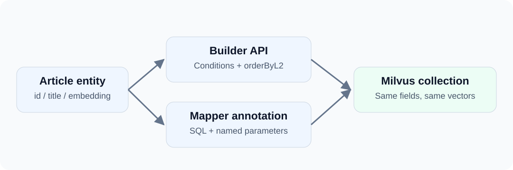

Once the first vector query works, applications usually need stable business operations: add an article, search within a category, or rename a title. Having every caller process ResultSet is not the only option.

This article adds dbVisitor on top of jdbc-milvus: map the collection to an entity, then organize operations behind a Mapper interface.

<!-- truncate -->



## Entity Mapping {#from-collection-to-entity}

In addition to the driver dependency from the [JDBC introduction](/blog/milvus-jdbc-vector-search), add:

```xml
<dependency>
    <groupId>net.hasor</groupId>
    <artifactId>dbvisitor</artifactId>
    <version>6.8.0</version>
</dependency>
```

This example uses its own blog_dao_articles collection with id, title, category and embedding fields. The complete project creates the collection, L2 index and load state; it does not depend on the previous article's data.

```java
@Table("blog_dao_articles")
public class Article {
    @Column(primary = true)
    private Long id;
    private String title;
    private String category;
    private List<Float> embedding;
    // Standard getters and setters are in the complete source.
}
```

Table and Column come from net.hasor.dbvisitor.mapping. The application supplies the ID here. Milvus FLOAT_VECTOR(2) maps directly to `List<Float>`; it does not require PostgreSQL's vector handler.

## Builder Inserts {#insert-with-the-builder}

```java
Article article = new Article();
article.setId(1L);
article.setTitle("Vector introduction");
article.setCategory("java");
article.setEmbedding(List.of(1F, 0F));

LambdaTemplate lambda = new LambdaTemplate(conn);
lambda.insert(Article.class).applyEntity(article).executeSumResult();
```

LambdaTemplate comes from net.hasor.dbvisitor.lambda. It generates INSERT from the mapping; the driver sends the write to Milvus. Annotating a class with Table does not create its collection automatically.

## Mapper Queries {#put-retrieval-behind-a-mapper}

A Mapper can extend `BaseMapper<Article>` and call the builder from a default method:

```java
@SimpleMapper
public interface ArticleMapper extends BaseMapper<Article> {
    default List<Article> nearest(String category, List<Float> vector)
            throws SQLException {
        return query()
                .eq(Article::getCategory, category)
                .orderByL2(Article::getEmbedding, vector)
                .initPage(2, 0)
                .queryForList();
    }
}
```

BaseMapper and SimpleMapper come from net.hasor.dbvisitor.mapper. initPage(2, 0) selects two records from page zero. For this vector search, that means the two nearest results, not loading the entire collection and sorting it in Java.

Create a Session from an open JDBC connection:

```java
try (Session session = new Configuration().newSession(conn)) {
    ArticleMapper mapper = session.createMapper(ArticleMapper.class);
    List<Article> articles = mapper.nearest("java", List.of(1F, 0F));
    System.out.println(articles.get(0).getTitle());

    mapper.update()
            .eq(Article::getId, 1L)
            .updateTo(Article::getTitle, "Revised guide")
            .doUpdate();
    Article loaded = mapper.selectById(1L);
    System.out.println(loaded.getTitle());      // Revised guide
    System.out.println(loaded.getEmbedding()); // [1.0, 0.0]
}
```

Session and Configuration come from net.hasor.dbvisitor.session.

## Method Annotations {#prefer-sql-use-a-method-annotation}

The same interface can declare:

```java
@Query("""
        SELECT id,title,category,embedding FROM blog_dao_articles
        WHERE category = #{category}
        ORDER BY embedding <-> #{vector} LIMIT 2
        """)
List<Article> search(@Param("category") String category,
                     @Param("vector") List<Float> vector);
```

Query and Param also come from net.hasor.dbvisitor.mapper. Calling mapper.search("java", List.of(1F, 0F)) still returns entities.

Use builders for code-driven conditions and annotations for short, stable queries. They can coexist; longer commands can live in Mapper files.

## Partial Updates {#change-a-title-without-rewriting-the-vector}

The `mapper.update()` call above shares the same Session as the query: only `title` changes, and `embedding` remains `[1.0, 0.0]`. Run all these calls before leaving the try block; closing a Session created from a Connection also closes that Connection.

The driver selects matching primary keys, then submits changed fields through native Partial Update. This operation changes the title without reading the vector back and resubmitting a complete entity.

:::note
Partial field updates are not transactions or optimistic locks. Concurrent changes to the same field still need application-level handling. Successful pages are not rolled back if a later page fails.
:::

## When to Use a DAO {#when-this-layer-is-useful}

Object mapping and Mappers help when several parts of the application read the same entity or when retrieval should be a business method. Direct JDBC can be enough for a few administrative commands.

See the example project ([GitHub](https://github.com/zycgit/dbvisitor/tree/main/dbvisitor-example/blog-680) / [Gitee](https://gitee.com/zycgit/dbvisitor/tree/main/dbvisitor-example/blog-680)) and run example.MilvusDao to compare both query styles and inspect the updated title. For multiple retrieval paths, continue with [Milvus hybrid search](/blog/milvus-hybrid-search).

References: [API selection guide](/docs/guides/api/about) · [Milvus vector operations](/docs/features/milvus/vectors) · [Writing data](/docs/features/milvus/write).
