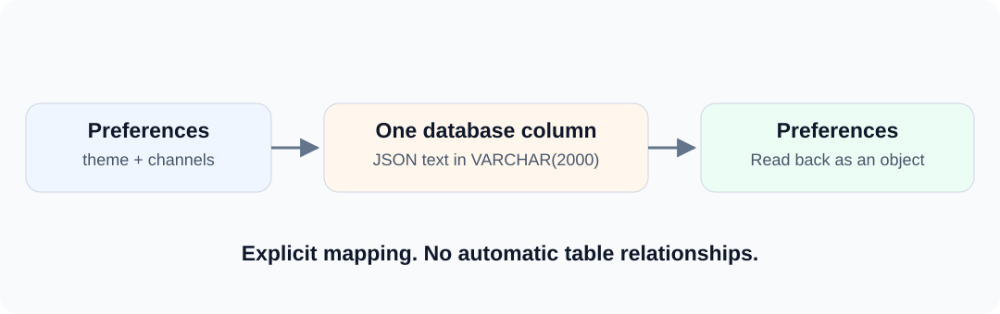

User preferences such as theme and notification channels are often read and changed together. Manually serializing and deserializing them in every DAO spreads conversion logic throughout the application.

dbVisitor lets you declare the conversion on a type: one Java object maps to one database field value.

<!-- truncate -->



## Storage Schema {#define-the-storage-target-first}

This example uses an H2 in-memory database, so no external service is needed:

```sql
CREATE TABLE blog_user_profile (
    id INT PRIMARY KEY,
    preferences VARCHAR(2000),
    attributes VARCHAR(2000)
);
```

preferences stores an object; attributes stores a Map. VARCHAR(2000) is simply a text column large enough for this example. Its name and length **do not automatically enable object mapping**.

The dependencies are dbVisitor, H2 and Gson. Run example.JsonField in the example project ([GitHub](https://github.com/zycgit/dbvisitor/tree/main/dbvisitor-example/blog-680) / [Gitee](https://gitee.com/zycgit/dbvisitor/tree/main/dbvisitor-example/blog-680)).

## Type Annotations {#prefer-a-type-annotation-for-a-business-class}

```java
@BindTypeHandler(JsonTypeHandler.class)
public class Preferences {
    private String theme;
    private List<String> channels;
    // Standard getters and setters are in the complete source.
}
```

The annotation is net.hasor.dbvisitor.types.BindTypeHandler; the handler is net.hasor.dbvisitor.types.handler.json.JsonTypeHandler. It declares how to convert a Preferences value, not how to map a table.

The outer entity declares column mappings:

```java
@Table("blog_user_profile")
public class UserProfile {
    @Column(primary = true)
    private Integer id;
    private Preferences preferences;

    @Column(typeHandler = JsonTypeHandler.class,
            specialJavaType = LinkedHashMap.class)
    private Map<String, Object> attributes;
    // Standard getters and setters are in the complete source.
}
```

Preferences can carry its own annotation, so each property need not repeat the handler. Map cannot carry your annotation; configure the property's Column and choose LinkedHashMap for deserialization instead.

## Object Read/Write {#insert-and-read-the-object-back}

```java
Preferences prefs = new Preferences();
prefs.setTheme("dark");
prefs.setChannels(List.of("email", "app"));

UserProfile profile = new UserProfile();
profile.setId(1);
profile.setPreferences(prefs);
profile.setAttributes(Map.of("language", "zh-CN"));

LambdaTemplate lambda = new LambdaTemplate(conn);
lambda.insert(UserProfile.class).applyEntity(profile).executeSumResult();

UserProfile loaded = lambda.query(UserProfile.class)
        .eq(UserProfile::getId, 1)
        .queryForObject();
```

loaded.getPreferences().getTheme() is dark, the channels are [email, app], and loaded.getAttributes().get("language") is zh-CN.

The preferences column contains text such as this; JSON property order does not affect its meaning:

```json
{"theme":"dark","channels":["email","app"]}
```

## Whole-Field Updates {#an-update-replaces-the-field-value}

```java
loaded.getPreferences().setTheme("light");
lambda.update(UserProfile.class)
        .eq(UserProfile::getId, 1)
        .updateTo(UserProfile::getPreferences, loaded.getPreferences())
        .doUpdate();
```

An in-memory change requires an explicit update. This serializes the complete new Preferences value, not a database expression that changes only a JSON path.

Separate requests modifying different JSON properties are not automatically merged. Use explicit database-native partial updates or concurrency control when that is required.

## Use Cases and Limits {#when-this-mapping-is-useful}

Small configurations and extension information read and written as a whole are good candidates. If internal properties frequently participate in sorting, filtering or joins, consider separate columns or native JSON queries.

The handler converts between Java values and JSON text. It does not determine how a database's native JSON type must be bound. When moving to PostgreSQL JSONB, for example, check that datasource's requirements rather than assuming VARCHAR behavior.

The complete example uses Gson. Existing applications may use supported Jackson, Gson or other JSON libraries; see [JSON serialization handlers](/docs/guides/types/json-serialization). For entity configuration, see [JSON field mapping](/docs/guides/core/mapping/json-field).

To reuse the same convention in a cache, continue with the [Redis product-cache example](/blog/redis-mapper-cache). The value is still JSON, but its storage is now a Redis String.
