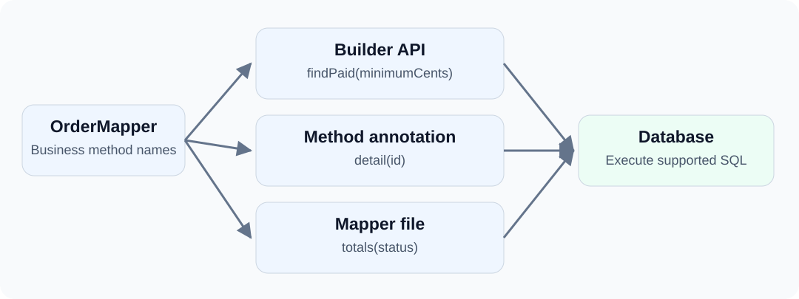

You do not have to choose between writing every query with a builder and putting every query in XML.

An order list can use property-based conditions, a detail lookup needs only one line of SQL, and a report benefits from a separately maintained statement. dbVisitor lets all three live behind the same Mapper interface.

<!-- truncate -->



## Assigning Query Styles {#assign-each-business-method-an-appropriate-style}

| Method | Style | Reason |
| --- | --- | --- |
| findPaid(minimumCents) | Builder API | Conditions directly reference entity properties |
| detail(id) | Method annotation | Keep a short, stable query close to its method |
| totals(status) | Mapper file | Maintain and extend report SQL separately |

This is not writing the same query three times. Each operation uses an appropriate expression.

## Entity and Data {#prepare-an-entity-and-data}

The example uses H2 in memory and integer cents for monetary amounts:

```sql
CREATE TABLE blog_orders (
    id INT PRIMARY KEY,
    status VARCHAR(20),
    amount_cents BIGINT
);
INSERT INTO blog_orders VALUES
(1,'PAID',1000),(2,'PAID',2000),(3,'NEW',5000);
```

```java
@Table("blog_orders")
public class Order {
    @Column(primary = true)
    private Integer id;
    private String status;
    @Column("amount_cents")
    private Long amountCents;
    // Standard getters and setters are in the complete source.
}
```

The complete project supplies dependencies, imports and accessors. Run example.ApiStyles.

## Combining Three Styles {#one-interface-three-implementations}

```java
@RefMapper("/mapper/orders.xml")
public interface OrderMapper extends BaseMapper<Order> {
    default List<Order> findPaid(long minimumCents) throws SQLException {
        return query()
                .eq(Order::getStatus, "PAID")
                .ge(Order::getAmountCents, minimumCents)
                .orderBy(Order::getId)
                .queryForList();
    }

    @Query("SELECT * FROM blog_orders WHERE id = #{id}")
    Order detail(@Param("id") int id);

    List<Map<String, Object>> totals(@Param("status") String status);
}
```

BaseMapper, RefMapper, Query and Param come from net.hasor.dbvisitor.mapper.

The default method reuses BaseMapper.query(). The detail command comes from its annotation. The totals command comes from the resource referenced by RefMapper. These do not require unrelated DAOs.

## XML Report Queries {#put-the-report-query-in-xml}

To keep the downloadable example compact, its Mapper is a static nested interface. The namespace is therefore its binary name, example.ApiStyles$OrderMapper. Use a normal fully qualified name such as com.example.OrderMapper for a top-level interface.

src/main/resources/mapper/orders.xml:

```xml
<?xml version="1.0" encoding="UTF-8"?>
<!DOCTYPE mapper PUBLIC "-//dbvisitor.net//DTD Mapper 1.0//EN"
        "https://www.dbvisitor.net/schema/dbvisitor-mapper.dtd">
<mapper namespace="example.ApiStyles$OrderMapper">
    <select id="totals" resultType="java.util.LinkedHashMap">
        SELECT status AS "status", SUM(amount_cents) AS "total_cents"
        FROM blog_orders
        WHERE status = #{status}
        GROUP BY status
    </select>
</mapper>
```

The XML id matches the interface method. This query uses SQL supported by the example database. RefMapper does not make GROUP BY executable on every datasource.

## Calling the Mapper {#callers-depend-only-on-the-mapper}

```java
try (Session session = new Configuration().newSession(conn)) {
    OrderMapper mapper = session.createMapper(OrderMapper.class);
    List<Order> orders = mapper.findPaid(1500);          // ID 2
    Order detail = mapper.detail(1);                     // amountCents = 1000
    List<Map<String, Object>> totals = mapper.totals("PAID"); // total_cents = 3000
}
```

All three calls use one Session. Closing a Session bound to a Connection closes that connection. The example keeps their resource lifetimes together and does not use the connection after closing the Session.

Use the database's supported transactions and a transaction manager when needed. Putting methods in one interface does not start a transaction.

## Choosing a Style {#consistency-does-not-require-rewriting-every-query}

Use builders for property-based conditions, method annotations for short statements, and Mapper files for longer SQL. Existing statements can also be executed with JdbcTemplate.

The shared value is the access entry point, parameter handling and mapping—not making every query look identical.

**Try it:** open the example project ([GitHub](https://github.com/zycgit/dbvisitor/tree/main/dbvisitor-example/blog-680) / [Gitee](https://gitee.com/zycgit/dbvisitor/tree/main/dbvisitor-example/blog-680)) and run example.ApiStyles. No external database is needed. See the [API selection guide](/docs/guides/api/about) and [Calling file Mappers](/docs/guides/core/mapper/file_statement) for more combinations.
