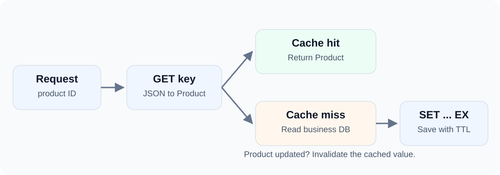

---
last_update:
  date: 2026-09-17
slug: redis-mapper-cache
topics: [datasources]
title: "Redis Product Caching with a Mapper"
description: "Use dbVisitor Mapper methods for Redis commands, map products to JSON, and manage cache expiration and eviction."
authors: [ZhaoYongChun]
tags: [dbVisitor, Redis, JDBC]
---

Redis has no relational tables, so what does a Mapper mean here? It means reusing Java interfaces, parameter binding and result mapping—not turning Redis into a SQL database.

A product cache can expose just save, load and evict. Underneath, those methods still execute Redis SET, GET and DEL.

<!-- truncate -->



## Cache Structure {#decide-what-the-cache-contains}

The key is demo:cache:product:p1001. Its String value stores a product summary:

```json
{"productId":"p1001","name":"USB-C Hub","priceCents":12900}
```

Prices use integer cents, and entries expire after 300 seconds. This is disposable, reconstructable cache data—not the only copy of the product.

## Connecting to Redis {#connect-to-redis}

Add net.hasor:dbvisitor:6.8.0 and net.hasor:jdbc-redis:6.8.0:all. JSON mapping also requires a supported JSON library; the example uses Gson.

```java
Properties props = new Properties();
// When authentication is enabled, read credentials from configuration.
// props.setProperty("password", System.getenv("REDIS_PASSWORD"));
try (Connection conn = DriverManager.getConnection(
        "jdbc:dbvisitor:jedis://127.0.0.1:6379?database=0", props);
        Session session = new Configuration().newSession(conn)) {
    // Execute the example operations here.
}
```

The artifact is jdbc-redis, but the URL prefix is **jedis**. Select a database through the database parameter. The example project ([GitHub](https://github.com/zycgit/dbvisitor/tree/main/dbvisitor-example/blog-680) / [Gitee](https://gitee.com/zycgit/dbvisitor/tree/main/dbvisitor-example/blog-680)) includes dependencies and imports.

## Object Mapping {#mapping-one-object-becomes-one-value}

```java
@BindTypeHandler(JsonTypeHandler.class)
public class Product {
    private String productId;
    private String name;
    private Long priceCents;
    // Standard getters and setters are in the complete source.
}
```

BindTypeHandler comes from net.hasor.dbvisitor.types, and JsonTypeHandler from net.hasor.dbvisitor.types.handler.json.

There is no Table annotation. The complete Product becomes JSON in a Redis String. Its properties are not table columns, and this does not implicitly generate Hash commands.

## Mapper Commands {#mapper-commands-are-executable-content}

```java
@SimpleMapper
public interface ProductCacheMapper {
    @Insert("SET #{key} #{product} EX #{seconds}")
    int save(@Param("key") String key,
             @Param("product") Product product,
             @Param("seconds") int seconds);

    @Query("GET #{key}")
    Product load(@Param("key") String key);

    @Delete("DEL #{key}")
    int evict(@Param("key") String key);
}
```

These annotations come from net.hasor.dbvisitor.mapper. The Insert annotation does not require an INSERT statement; the adapter executes its supported Redis command.

The type handler serializes the product parameter to JSON. After GET, the target type tells it how to reconstruct Product. Do not manually wrap JSON with command quotes.

## Write, Read and Evict {#write-read-and-evict}

```java
ProductCacheMapper mapper = session.createMapper(ProductCacheMapper.class);
String key = "demo:cache:product:p1001";

Product product = new Product();
product.setProductId("p1001");
product.setName("USB-C Hub");
product.setPriceCents(12900L);

mapper.save(key, product, 300);
Product cached = mapper.load(key);
System.out.println(cached.getName());       // USB-C Hub
System.out.println(cached.getPriceCents()); // 12900

mapper.evict(key);
System.out.println(mapper.load(key));       // null
```

SET writes both the value and expiration in one command. A later save replaces the entire cached value and resets its TTL.

On a miss, application code reads the primary database and calls save. Invalidate the cache after changing the product. This is not a transaction spanning the database and Redis, nor does it automatically solve cache stampedes or stale concurrent refills.

## Redis Semantics {#what-remains-unchanged}

Redis keys, data structures and expiration semantics stay the same. Java interfaces organize the commands; Mapping handles value conversion.

This is how dbVisitor treats native commands: SQL, Redis commands and MongoDB commands can all be executable content, within the corresponding driver's syntax.

**Run the complete example:** example.RedisCache uses an isolated demonstration key, prints misses, hits, TTL and eviction results, and removes its own key. It does not run FLUSHDB or clear the business database.

More scenarios: [Product cache](/docs/features/redis/scenarios/product-cache) · [Shopping cart](/docs/features/redis/scenarios/shopping-cart) · [Points leaderboard](/docs/features/redis/scenarios/points-ranking).
