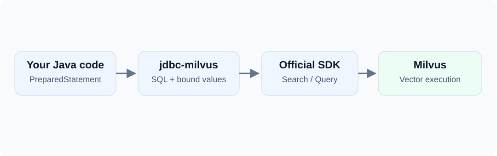

If your application already uses Java and JDBC, can it keep passing parameters through PreparedStatement and reading results through ResultSet when it adds Milvus?

jdbc-milvus provides that entry point. This command finds the two closest vectors within an article category:

```sql
SELECT id, title, score FROM blog_jdbc_articles
WHERE category = ?
ORDER BY embedding <-> ? LIMIT 2;
```

The first parameter is the category; the second is a vector. You still need to understand vector search, but you can keep a familiar Java calling style.

<!-- truncate -->

## Standalone JDBC Driver {#a-driver-you-can-use-independently}



jdbc-milvus translates its supported SQL-style commands into official SDK calls. Scalar queries use Query; vector searches use Search. Milvus performs the database work.

Your application does not have to adopt dbVisitor's builders or Mappers. Start with JDBC and add object mapping only when it helps.

:::note
This SQL is a command language provided by the driver. It is not a new SQL protocol in the Milvus server, nor does it support arbitrary MySQL or PostgreSQL statements.
:::

## Dependency and Connection {#add-the-dependency-and-connect}

```xml
<dependency>
    <groupId>net.hasor</groupId>
    <artifactId>jdbc-milvus</artifactId>
    <version>6.8.0</version>
    <classifier>all</classifier>
</dependency>
```

The example targets dbVisitor 6.8.0 and Milvus 2.6.x, with a minimum server version of 2.6.2.

```java
Properties props = new Properties();
props.setProperty("consistencyLevel", "Strong");
// When authentication is enabled, read credentials from configuration.
// props.setProperty("token", System.getenv("MILVUS_TOKEN"));

try (Connection conn = DriverManager.getConnection(
        "jdbc:dbvisitor:milvus://127.0.0.1:19530/default", props)) {
    // Execute the example operations here.
}
```

Connection and DriverManager come from java.sql; Properties comes from java.util. The downloadable source includes all imports.

For Zilliz Cloud, use the host, port, database and credentials from your console, and enable secure=true. See [Zilliz Cloud connections](/docs/drivers/milvus/connection#cloud).

## Collection and Index {#prepare-the-collection-and-index}

Each record has an ID, title, category, and a two-dimensional vector:

```sql
CREATE TABLE blog_jdbc_articles (
    id INT64 PRIMARY KEY,
    title VARCHAR(256),
    category VARCHAR(32),
    embedding FLOAT_VECTOR(2)
) WITH (consistency_level='Strong');

CREATE INDEX idx_embedding ON blog_jdbc_articles(embedding)
USING AUTOINDEX WITH (metric_type='L2');

LOAD TABLE blog_jdbc_articles;
```

Execute the three commands separately with Statement.executeUpdate(). CREATE TABLE creates a Milvus Collection. FLOAT_VECTOR(2) requires exactly two components. The index uses L2, matching the subsequent `<->` search.

Strong consistency on the collection makes the example's immediate reads easier to reproduce. Iterator-based reads cannot rely only on the connection's consistency setting.

## Parameterized Writes {#bind-a-vector-when-inserting}

```java
String sql = """
        INSERT INTO blog_jdbc_articles(id,title,category,embedding)
        VALUES (?,?,?,?)
        """;
try (PreparedStatement insert = conn.prepareStatement(sql)) {
    insert.setLong(1, 1L);
    insert.setString(2, "Vector introduction");
    insert.setString(3, "java");
    insert.setObject(4, new float[] {1, 0});
    insert.executeUpdate();
}
```

There is no need to assemble a vector string. FLOAT_VECTOR accepts float[] or a numeric list with the declared dimension.

The complete example inserts these records:

| id | title | category | embedding |
| --- | --- | --- | --- |
| 1 | Vector introduction | java | [1, 0] |
| 2 | Mapper guide | java | [0, 1] |
| 3 | Other category | python | [1, 0] |

These are demonstration vectors, not semantic embeddings generated from the titles. Real text retrieval needs a suitable embedding model, with matching models and dimensions for documents and queries.

## Search Results {#search-and-read-the-results}

```java
try (PreparedStatement search = conn.prepareStatement("""
        SELECT id,title,score FROM blog_jdbc_articles
        WHERE category = ? ORDER BY embedding <-> ? LIMIT 2
        """)) {
    search.setString(1, "java");
    search.setObject(2, new float[] {1, 0});
    try (ResultSet rows = search.executeQuery()) {
        while (rows.next()) {
            System.out.println(rows.getLong("id") + " | "
                    + rows.getString("title") + " | " + rows.getFloat("score"));
        }
    }
}
```

Output:

```text
1 | Vector introduction | 0.0
2 | Mapper guide | 2.0
```

The third record has an exact vector match but is excluded by the category filter. Here score is Milvus's L2 score, the squared Euclidean distance: smaller is closer. It is not a percentage. Interpret scores according to the selected metric.

## Capability Limits {#familiar-access-database-specific-behavior}

JDBC lets you reuse parameter binding and result reading. It does not turn Milvus into a relational database: JDBC Batch, transactions and JOIN are unsupported, and paged writes do not provide cross-page rollback.

Explore additional capabilities when needed: vector types, Hybrid Search, BM25, generated keys, collection management and Import. See the [Milvus command reference](/docs/features/milvus/about).

**Try it:** open the example project ([GitHub](https://github.com/zycgit/dbvisitor/tree/main/dbvisitor-example/blog-680) / [Gitee](https://gitee.com/zycgit/dbvisitor/tree/main/dbvisitor-example/blog-680)) and run example.MilvusJdbc. It creates its own collection and removes it afterward. Use a test database.

To read entities instead of processing ResultSet rows yourself, continue with [Building a Milvus vector-search DAO](/blog/milvus-vector-dao).
